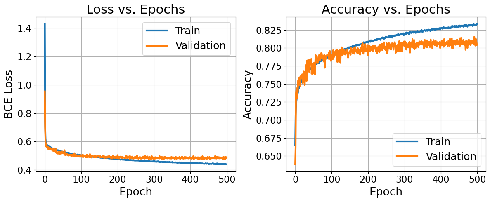
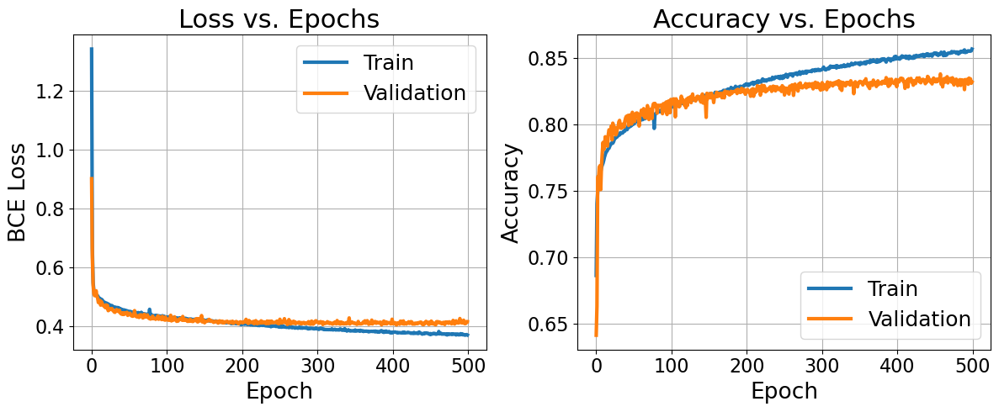

# Detecting Duplicate Quora question pairs

*Teammate: Valerios Stais*

## Introduction

In our MSc we had as part of an exercise to detect duplicate questions posted 
on Quora. The dataset, which was given by Quora in a 2017 
[Kaggle competition](https://www.kaggle.com/c/quora-question-pairs/overview), consisted 
283k question pairs along with their label, duplicate or non-duplicate. We must note that 
the question pairs were carefully picked so as to be difficult to correctly classify. For 
example, the question pair "*Why if my brown fox quick?*" -"*Where is my lazy dog?*" can 
easily be labelled as non-duplicate by a human and any suitably trained model. However, 
the question pair "Are brown foxes quick?" and "Are brown dogs quick?" is more difficult 
to be correctly classified by a model. The dataset given consists mostly of the second 
kind of questions.

## Code
* On `DuplicateDetectionFeatureEngineering.ipynb` we present a range of hand-engineered features
which help us establish a baseline
* On `EmbeddingMatrix.ipynb` we embed our whole dataset using a pretrained Word2Vec model
* `Trainer.py` can be considered as the "main" which reads the embeddings, sets up the model, defines
the callbacks, and finally trains and evaluates our model
* `SiameseLSTM/` contains all the source code that `Trainer.py` imports

## Baseline approach with feature engineering

In the assignment the expected approach was to hand-craft a set of heuristics that would help us extract features from the given questions. Some of the extracted features were:
* Cosine similarity of question tf-idf representation
* Edit distance of questions*
* Each question's word length (original question)
* Each question's word length (preprocessed question)
* Each question's word length (preprocessed with google's recommended function question)
* Number of names in each question (beginning with a capital letter, excluding first word)
* Cosine similarity between average name vector of each question
* Number of stowords in each question, and difference of that number between questions
* Number of punctuation symbols in each question, and difference of that number between questions
* Edit distance between each question's words not present in Google News embedding*
* Number of digits in each question, and difference of that number between questions
* Number of nouns in each question, and difference of that number between questions
* Edit distance between each question's nouns
* Edit distance between each question's last half/last quarter*
* Edit distance between each question's first 4 words*

*Concerning edit distance, we consider a collection of metrics such as simple, partial ratios, token sort ratio and token set ratio.

We experimented with different combinations of the above features and machine learning models (SVM, Logistic Regression, Random Forest, XGBoost), and found that the optimal combination comprises all the aforementioned features and a tuned XGBoost classifier.

| Statistical Measure | XGBoost |
|---------------------|---------|
| Accuracy            | 0.7657  |
| Recall              | 0.7486  |
| Precision           | 0.7491  |
| F1-score            | 0.7489  |
*Table 1: Validation average metrics (5-fold) using engineered features*

We get a validation accuracy of 0.7657 which is a nice first result but in order to better capture the distributions of duplicate and non-duplicate question pairs we would have to extract many more features. Instead, we thought of an approach that excels in capturing these distributions using a siamese LSTM.

## Siamese LSTM
Siamese networks were first proposed as an architecture for efficient face verification (Taigman et al. [1]). The network was given facial images of many people, with few images per person, and had to successfully infer whether two images depicted the same person or not. We must note that, in general, for this technique to work we must present hard pair (Schroff et al. [2]). Luckily, our dataset consists of question pairs whose duplicacy is hard to distinguish.

In the image field, the siamese networks consist of convolutional kernels. These are great for encoding the information that the network needs to decide whether two face images are of the same person. However, in our case, we have a more suitable tool called LSTM cell, which is great at encoding sequences, in our case questions. We implemented a variation  of the siamese architecture proposed by Thyagarajan et al. [3]. We avoided using the Manhattan distance of the question encodings and instead added dense layers that input these encodings. Our hypothesis is that the dense layers will learn the most appropriate distance function.

*The model is defined on `SiameseLSTM/SiamLSTM.py`*

Concerning the word embeddings, we used the pretrained Google news embeddings. We believe that training our own embeddings from scratch or even fine-tuning the pretrained ones would be overambitious given the limited time and hardware we had.

We trained the network with a batch size of 1,024, using the Adam optimizer with a learning rate of 0.001. We appropriately used dropout and regularization on both the LSTM and the dense layers to avoid overfitting. The training took 5 hours on an Nvidia 2060 Super (8GB). In the figure, we can see that even with the usage and tuning of dropout and regularization we were not able to successfully combat overfitting. We believe that further tuning would be able to alleviate the issue.

Furthermore, we can see that even the overfitted network was able to achieve a validation **accuracy of 0.80**. This is a welcomed result, since it represents an increase of 0.04 when compared to the best feature engineering model.

## Combining engineered features with the Siamese LSTM

As a final model, we wanted to both combine the question encodings created by the siamese LSTM and the engineered features we created in the first part of this task. We believe that adding these hand-crafted features would help the network to better understand our objective of finding duplicate questions.

*The model is defined on `SiameseLSTM/SiamLSTMwithFeatures.py`*

In the above figure, we present the way we "inject" the new features into the duplicate classification decision. We avoid immediately concatenating them next to the LSTM encodings, and we first transform them using a dense layer. The main reason is to avoid scaling issues. For example, the LSTM encodings may have large values while the engineered features (which are first normalized) will have small values around 0. The added dense layer will be able to learn an appropriate re-scaling so as the engineered features will have a chance at being a part of the final decision. We hypothesize that this dense layer may also be replaced by a batch normalization layer, though we did not test this hypothesis.

From the learning curves, we have two main takeaways. First, the validation set accuracy increased from **0.80 to 0.83**. Second, while the overfitting observed before persists, it occurs much later in the training. We must note that the regularization, dropout and learning rate hyperparameters were the same in both runs. This suggests that the added features had an additional regulatory effect.

We believe the engineered features and the siamese LSTM tackle the duplicate detection task from two different angles. The LSTM is great at capturing context, along with syntactic and grammatical information. On the other hand, our engineered features focus almost exclusively on the content (vocabulary) of the two questions. By combining information from both these techniques our complete neural net is more stable at training when compared to the pure siamese LSTM, and also achieves better accuracy.

## References

[1] Yaniv Taigman, Ming Yang, Marc’Aurelio Ranzato, and Lior Wolf. Deepface:Closing the gap to human-level performance in face verification. InProceedingsof the IEEE Conference on Computer Vision and Pattern Recognition (CVPR),June 2014.

[2] Florian Schroff, Dmitry Kalenichenko, and James Philbin. Facenet: A unified em-bedding for face recognition and clustering. InProceedings of the IEEE Conferenceon Computer Vision and Pattern Recognition (CVPR), June 2015.

[3] Aditya Thyagarajan. Siamese recurrent architectures for learning sentence simi-larity. 11 2015.